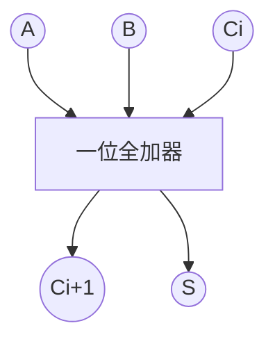

---
tags:
  - application
---
由[[标准SOP]]和[[逻辑运算律]]就可以构造**加法器**

# 一位全加器

$$
\begin{aligned}
&S=(A\oplus B)\oplus C_{i}\\
C_{i+1}=AB+BC&+CA=AB\overline{C}+A\overline{B}C+\overline{A}BC+ABC
\end{aligned}
$$

# 两位加法器
可以用拆解的思维把两位拆解为两个一位

